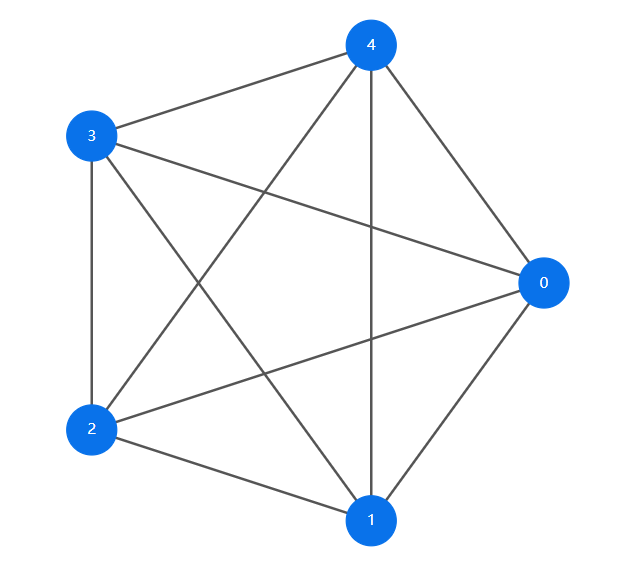
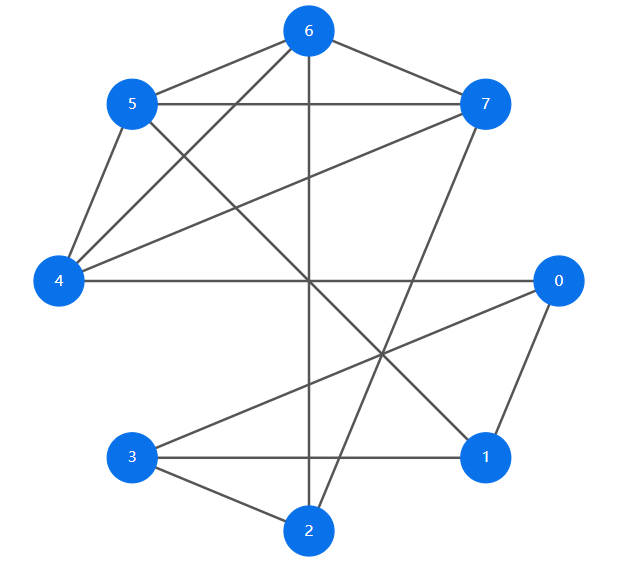
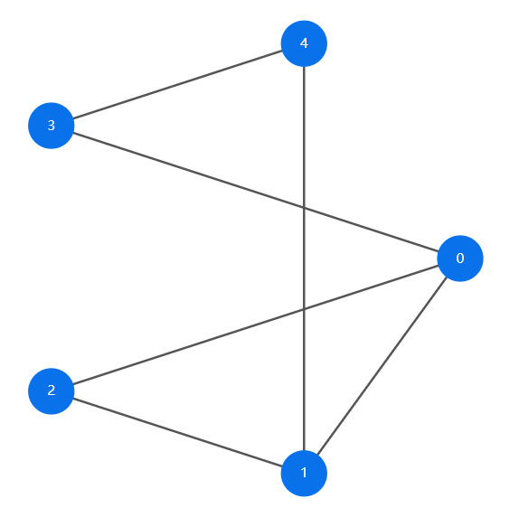
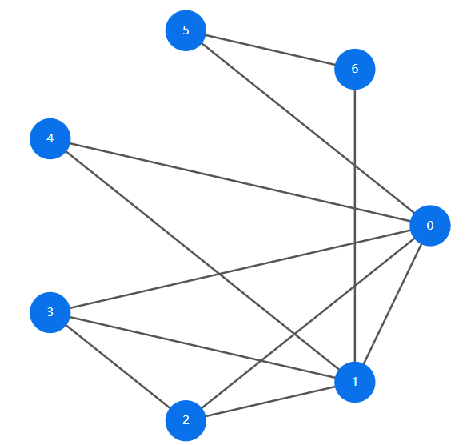

<!--
 * @Author: bohemian
 * @Date: 2024-05-11 11:16:52
 * @LastEditors: BOHEMIAN 2399021159@qq.com
 * @LastEditTime: 2024-05-16 11:27:20
 * @FilePath: \graph_theory-main\README.md
 * @Description: 
 * 
 * Copyright (c) 2024 by ${git_name_email}, All Rights Reserved. 
-->
# 使用说明
## 功能说明
这是一个根据度序列判断是否为图序列并生成图的网页代码。首先在输入框中输入度序列，然后点击“生成图”按钮，系统会判断输入的度序列是否为图序列，并生成相应的图的网页代码。
## 测试环境
使用的是最新版的EDGE浏览器，其他浏览器可能无法正常显示。
## 注意事项
1. 输入框中只能输入整数，并且每个整数之间用空格隔开，例如：“1 2 3”；最后不能输入空格。错误示例：“1 2 3 ”。
2. 输入的度序列必须是非负整数，并且每个整数都必须大于等于0。
## 测试结果
1. 使用教材P3中的图进行测试。

（a）4 4 4 4 4 （b）3 3 3 3 4 4 4 4 （c）3 3 2 2 2 （d）5 5 3 3 2 2 2 

### 测试结果

图 1. a  

图 2. b  

图 3. c 

图 4. d 

2. 测试反例
   
（a）1 0 （b）2 2 （c）3 3 3 

图 5.a 

图 6.b 

图 7.c  

